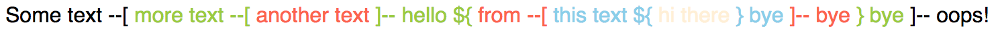
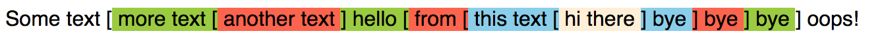

# [React String Color Parser](https://www.npmjs.com/package/react-string-color-parser)

## Pretty narrow use cases :)

* npm install react-string-color-parser

### Usage example
 ```
 import Parser from 'react-string-color-parser';
 ...
 
 <Parser
    tag="span"
    fontSize={16}
    delimiters={[{start: '${', end: '}'}, {start: '--[', end: ']--'}]}
    colors={['yellowgreen', 'tomato', 'skyblue', 'papayawhip']}
    defaultColor="black"
 />
 ```
 
 Result 
 
 
 
  ```
  import Parser from 'react-string-color-parser';
  ...
  
  <Parser
    colors={['yellowgreen', 'tomato', 'skyblue', 'papayawhip']}
    solidHighlight
    searchWords={['first', 'second']}
  />
  ```
  
  Result 
  
  
 
 **Props**  
 
 * **tag** - HTML tag to wrap string pieces. Default - 'span'
 
 * **delimiters** - an array of delimiters for parser to respect when dividing a string.
  
 * **colors** - an array of color representations for nested string parts.
  
 * **fontSize** - custom font size for input component. Default - 16px
  
 * **defaultColor** - a color for nesting depth that out of range due to size of colors array. Default - 'lightsalmon' 
 
 * **solidHighlight** - A boolean flag defining whether to highlight text with background style. Default - false
  
 * **searchWords** - Dynamically treated array of strings to be highlighted when found. When specified - cancels delimiters rule! 
 
 * **caseSensitive** - a boolean flag to set case sensitivity for searching words 
 
